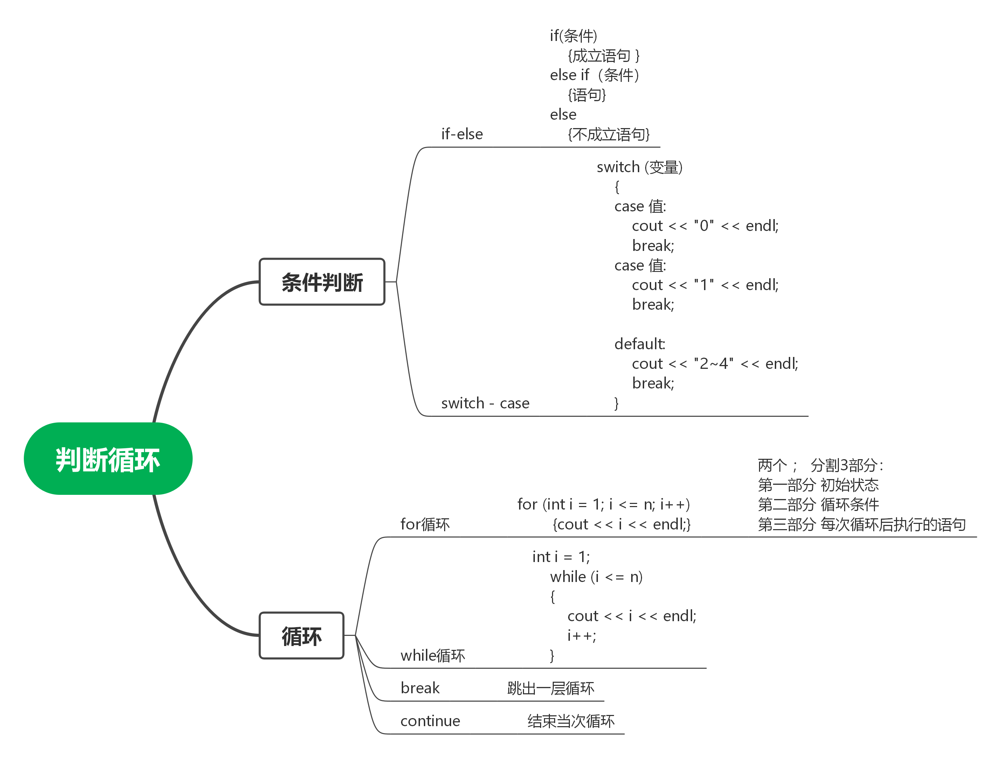

#### 作业-分支结构

P5710,P5711,P5712,P5713,P5714,P5715,P5716,P1085,P1909,P1055,P1422,P1424,P1888,P1046,P5717,P4414

#### 作业-循环结构

P5718,P5719,P5720,P5721,P1009,P1980,P1035,P2669,P5722,P5723,P1217,P1423,P1307,P1720,P5724,P1420,P1075,P5725,P5726,P4956,P1089

#### 思维导图
